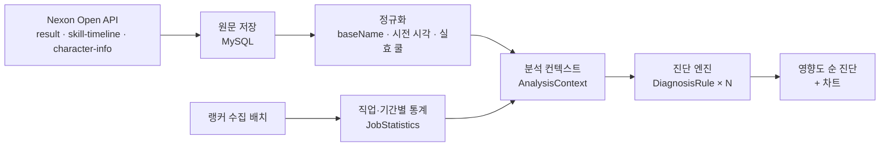

# Battle Coach

메이플스토리 **연무장** 기록을 불러와 딜 사이클의 문제를 **자동으로 진단**하고, 다른 기록·랭커와 비교해 주는 웹 서비스입니다.

기존 연무장 기록 서비스는 DPS 순위와 타임라인을 **보여주기만** 하고, 무엇이 문제인지는 유저가 눈으로 찾아야 합니다.
Battle Coach는 "쿨이 돌았는데 쓰지 않은 스킬", "랭커와 다르게 쓰는 연동 스킬", "극딜 순서 차이"를 찾아 **데미지 영향도 순**으로 알려줍니다.

> 데이터 수집 → 정규화 → 알고리즘 분석 → 설명 가능한 피드백. 개인 포트폴리오 프로젝트입니다.

## 주요 기능

| 화면 | 내용 |
|---|---|
| 닉네임 검색 | 캐릭터의 기간별 연무장 기록 목록 |
| 기록 상세 | 진단 요약(고칠 점 수·합계 손해), 랭커 분포 속 내 위치, 쿨 대비 실제 사용 간격, 스킬별 데미지 점유율, 스킬 사용 타임라인(시퀀스·극딜 구간 표시) |
| 기록 비교 | 같은 직업의 다른 기록(시즌 간 또는 다른 캐릭터)과 비교: 운용 / 구성·스펙으로 나눈 진단, 스킬 레벨 비교, 시전 횟수 차이, 딜 비중 차이의 원인, 극딜 순서 정렬, 두 기록을 겹친 타임라인 |
| 랭커 통계 | 직업·기간별 랭커 표본을 모아 분당 시전 수 분포, 함께 쓰는 스킬 묶음, 표준 극딜 순서를 자동으로 얻음 |

### 진단 예시 (실제 기록)

```
진단: 고칠 점 3개 · 합계 7.4초 손해 (DPS의 2.19%)

1. [랭커보다 적은 시전] 솔 헤카테 : 스틱스         2.6초 (DPS의 0.77%)
   이 스킬을 쓴 랭커 11명의 분당 시전 수는 중앙값 1.07회인데 이 기록은 0.53회입니다.
2. [놓친 시전] 크레스트 오브 더 솔라               2.4초 (DPS의 0.72%)
   실효 쿨 221.6초인데 쿨이 돈 뒤 쓰지 않은 시간이 117.4초라 약 1회를 놓쳤습니다.
3. [랭커보다 적은 시전] 스파이더 인 미러           2.4초 (DPS의 0.70%)
   이 스킬을 쓴 랭커 11명의 분당 시전 수는 중앙값 0.35회인데 이 기록은 0.18회입니다.

참고: [연동 스킬 따로 사용] 두 스킬을 모두 쓴 랭커 11명 중 91%가 스틱스를 데스 블로섬과
      1초 안에 함께 씁니다. 이 기록은 0/3회입니다.
```

## 동작 방식



1. **수집**: 리플레이 한 건에 API 3종(결과, 스킬 사용 내역, 입장 시점 스펙)을 부르고 **원문을 그대로 저장**합니다. 파서나 규칙을 고치면 API를 다시 부르지 않고 저장된 원문으로 재분석합니다.
2. **정규화**: API마다 다른 스킬 표기(`보이드 러쉬` / `보이드 러쉬 VI`)를 `baseName`으로 묶습니다. 효과 텍스트에서 기본 쿨·지속시간·예외 문구를 파싱하고, 캐릭터의 쿨감 스탯으로 **실효 쿨**을 계산합니다.
3. **분석**: 단일 진단, 비교 진단, 통계 진단 모두 **같은 엔진**에 입력(`AnalysisContext`)만 달리 넣습니다. 규칙은 `DiagnosisRule` 인터페이스 구현체로 분리되어 있어, 규칙을 추가해도 엔진은 바뀌지 않습니다.
4. **피드백**: 손해를 "평균 DPS로 몇 초 치인가(초 환산)"로 나타내고, 1초 미만은 측정 오차로 보고 거릅니다.

## 진단 규칙

| 규칙 | 기준 | 영향도 |
|---|---|---|
| 놓친 시전 | 내 기록 (쿨마다 쓰는 것이 이상) | 쉰 시간 ÷ 실효 쿨 × 1회 데미지 |
| 시전 수 부족 | 비교 기록 (전투 시간 보정) | 부족한 시전 수 × 내 1회 데미지 |
| 미보유·미사용 | 비교 기록의 스킬 구성 | 기준 기록의 초 환산으로 추정 |
| 랭커보다 적은 시전 | 랭커 하위 25% 미만 | 중앙값까지 모자란 시전 × 내 1회 데미지 |
| 연동 스킬 따로 사용 | 랭커 80% 이상이 함께 쓰는 쌍 | 참고 (영향도 없음) |
| 극딜 순서 다름 | 랭커 80% 이상이 합의한 앞뒤 순서 | 참고 (영향도 없음) |

진단은 **운용(바로 고칠 수 있는 것)**과 **구성·스펙(레벨·해금)**으로 나누고, 같은 스킬의 같은 손해를 여러 규칙이 두 번 세지 않도록 엔진이 합칩니다.

## 데이터로 검증하며 바꾼 설계

추측으로 정한 기준은 실제 기록으로 확인하고, 틀리면 바꿨습니다.

- **쿨감 공식**: 처음 쓴 `(기본 쿨 − 초 감소) × (1 − % 감소)`는 실측 사용 간격보다 **긴** 쿨을 계산했습니다(판데모니움 24.44초 vs 실측 24.24초). 커뮤니티에 정리된 규칙(% 감소 먼저, 10초 초과분만 초 감소, 이하 구간은 1초당 5%)으로 바꾸자 쿨 30초 이상 스킬 전부에서 실측과 모순이 없었습니다.
- **초 환산은 상대 지표**: 스킬별 "데미지 ÷ 총 DPS"의 합은 항상 전투 시간과 같습니다. 한 스킬 비중이 오르면 다른 스킬이 내려가므로, 비교할 때는 차이를 **시전 수 효과**와 **1회 효율 효과**로 나누고 손해는 내 DPS 기준으로만 계산합니다.
- **짧은 쿨 스킬 오탐**: 쿨 11~12초 스킬은 **랭커 전원이** 시전의 40~75%를 "놓쳤습니다"(짧은 쿨 스킬끼리 시전 시간을 두고 경쟁). 쿨 23초 이상인 스킬은 0~2회였습니다. 그래서 절대 기준인 "놓친 시전"만 15초 이상 스킬로 제한하고, 랭커·비교 기록 대비 규칙은 10초를 유지했습니다(같은 손실이 기준 쪽에도 있어 상쇄).
- **재발동 스킬**: "스킬을 다시 사용하여 즉시 종료"하는 스킬은 다시 누른 입력도 시전으로 기록되어 쿨이 바뀌는 스킬로 잘못 분류됐습니다. 효과 텍스트의 재사용 문구로 찾아, 지속시간 안의 재입력을 합칩니다.
- **"극딜까지 아끼는 게 손해인가" 가설**: 기록 2개로 세운 가설을 랭커 11명으로 확인(스피어만 순위 상관)한 결과, 판데모니움은 20~27초 아껴도 시전 수가 줄지 않았습니다(ρ = +0.04). 가설은 지지되지 않았습니다. 반면 쿨 51초인 스틱스는 아낄수록 시전 수가 줄었습니다(ρ = −0.76).

모든 직업을 지원하는 것이 목표라, **직업별 값을 사람이 입력하지 않습니다**. 극딜 구간, 쿨이 바뀌는 스킬, 연동 스킬 묶음, 표준 극딜 순서는 모두 기록과 통계에서 자동으로 찾습니다. 예를 들어 칼리 랭커 표본에서는 "데스 블로섬 · 스틱스 · 레디 투 다이를 1분마다 함께 쓴다(91%)"는 묶음이 저절로 드러났습니다.

## 기술 스택

- **Backend**: Java 17, Spring Boot 4, Spring Data JPA (Hibernate 7), MySQL, Caffeine, Lombok
- **Frontend**: Thymeleaf, ECharts, 순수 CSS·SVG
- **Test**: JUnit 5, AssertJ, Mockito (102개)

### 구현 포인트

- **호출량 제한 준수**: 개발 키(초당 5건, 하루 1,000건)에 맞춘 토큰 버킷, 429·5xx 지수 백오프 재시도
- **중복 호출 방지**: 같은 리플레이 동시 요청을 한 번의 API 호출로 합치는 `SingleFlight`, 리플레이는 불변 데이터라 DB에 영구 저장
- **랭커 수집 배치**: 호출 상한을 넘기 전에 멈추고, 확인한 랭커(기록 없음 포함)를 저장해 다시 부르지 않음
- **서열 정렬**: 두 극딜 순서를 Needleman-Wunsch로 정렬해 빠진 스킬과 순서가 다른 스킬을 드러냄
- **XSS 방지**: 유저가 입력한 시퀀스 이름을 차트 데이터로 넣을 때 `</script>` 주입을 막기 위해 `<`를 이스케이프

## 패키지 구조

```
com.battlecoach
├─ nexon       Nexon Open API 클라이언트, 호출량 제한, DTO
├─ replay      리플레이 수집·저장·조회, 화면(Thymeleaf), 비교
├─ spec        character-info 파싱: 스킬 쿨·예외 문구, 실효 쿨 계산
├─ diagnosis   분석 컨텍스트, 진단 엔진과 규칙, 극딜 탐지, 서열 정렬, 통계
├─ ranker      랭커 표본 수집 배치, 직업·기간별 통계
└─ global      캐시, 동시성(SingleFlight), 오류 처리
```

## 실행

**준비**: Java 17, MySQL 8, [Nexon Open API](https://openapi.nexon.com/) 키

1. MySQL에 `battle_coach` 스키마를 만듭니다. 테이블은 실행할 때 자동으로 생성됩니다.
2. `src/main/resources/application-local.yml`을 만듭니다. 이 파일은 `.gitignore` 대상입니다.

   ```yaml
   DB_USERNAME: root
   DB_PASSWORD: your-password
   NEXON_API_KEY: your-api-key

   collector:
     enabled: true   # 랭커 수집 관리 API (인증이 없으니 로컬에서만)
   ```

   환경변수 `DB_USERNAME`, `DB_PASSWORD`, `NEXON_API_KEY`로 넣어도 됩니다.
   DB 주소는 `application.yml`의 `spring.datasource.url`(기본 `localhost:3308`)에서 바꿉니다.
3. 실행합니다.

   ```bash
   ./gradlew bootRun
   ```

4. http://localhost:8888 에서 캐릭터명을 검색합니다.

### 랭커 표본 수집 (로컬 관리 API)

랭커 대비 진단은 같은 직업·기간 표본이 5개 이상일 때 동작합니다.

```bash
# 칼리 랭커를 확인해 최근 기간 기록 표본을 모은다 (API 호출 400건 상한)
curl -X POST "http://localhost:8888/api/admin/rankers/collect?jobClass=%EC%B9%BC%EB%A6%AC-%EC%A0%84%EC%B2%B4%EC%A0%84%EC%A7%81&maxCalls=400&maxSamples=10"

# 진행 상황
curl http://localhost:8888/api/admin/rankers/status
```

`jobClass`는 `직업군-전직` 형식입니다(예: `마법사-비숍`, 전직이 없는 직업은 `칼리-전체전직`). 한글은 URL 인코딩해서 보냅니다.

### 테스트

```bash
./gradlew test
```

## 한계

- **표본 규모**: 개발 키는 하루 1,000건인데, 랭커 확인 비용의 약 80%가 연무장 기록이 없는 랭커에서 나갑니다(랭킹 API가 ocid를 주지 않아 줄일 수 없음). 현재 표본은 직업당 5~11개라 통계는 "경향" 수준입니다. 서비스 키 승인이 필요합니다.
- **랭커 = 레벨 순위**: 넥슨 API에 연무장 DPS 순위가 없어 종합(레벨) 랭킹에서 표본을 뽑습니다. 실력 순위와 다를 수 있습니다.
- **쿨감 규칙**: 공식 문서가 없어 커뮤니티 규칙과 실측으로 검증했습니다. 스킬 하나에만 붙는 하이퍼 "쿨타임 리듀스"는 아직 반영하지 않았습니다.
- **극딜 정렬의 영향도**: 버프 배율을 추정할 근거가 부족해, 순서 차이는 영향도 없이 참고로만 보여줍니다.

## 데이터 출처

게임 데이터는 [NEXON Open API](https://openapi.nexon.com/)를 사용합니다. 화면 디자인은 연무장의 색감만 참고했으며, 게임 이미지·로고는 사용하지 않았습니다.
이 프로젝트는 넥슨과 관련이 없는 개인 프로젝트입니다.
